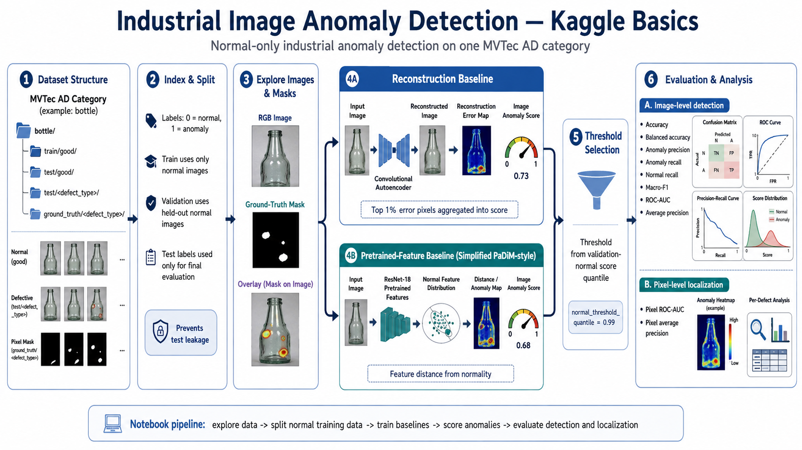

# Industrial Anomaly Detection Basics

## Project Overview

This project studies normal-only industrial image anomaly detection using
reconstruction-based and pretrained-feature approaches.

## Objectives

- Understand normal-only training
- Detect anomalous industrial images
- Localize defects using anomaly heatmaps
- Compare reconstruction and feature-based methods
- Evaluate class-balanced performance

## Methods

1. Convolutional Autoencoder
2. Pretrained ResNet-18 Feature Distribution Baseline

## Dataset

The project uses an MVTec-style dataset.

The dataset is not included in this repository. See `data_instructions.md`.

## Evaluation Metrics

- Accuracy
- Balanced accuracy
- Anomaly precision
- Anomaly recall
- Normal recall
- Macro-F1
- ROC-AUC
- Average precision

- ## Project Workflow

The following diagram summarizes the complete industrial anomaly-detection pipeline:



## Repository Structure

```text
notebooks/   Jupyter notebook
figures/     Confusion matrices, curves and anomaly maps
results/     Metrics and experiment summaries
