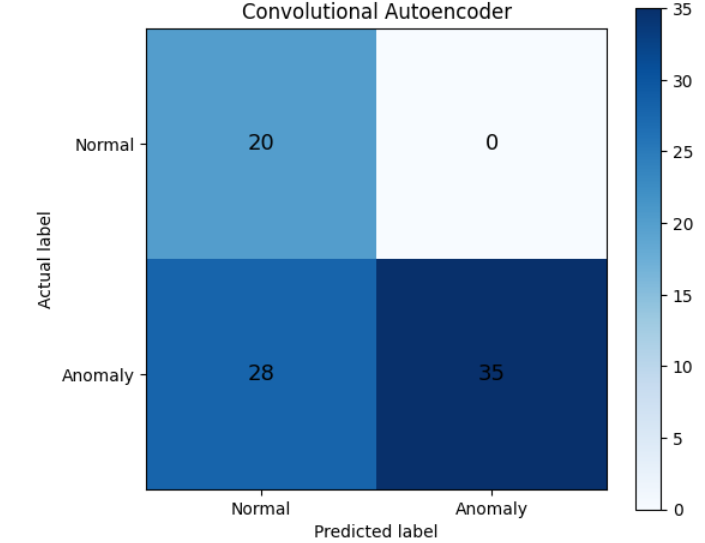
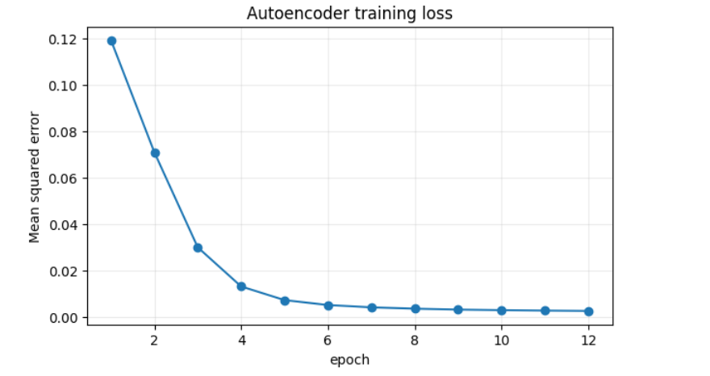
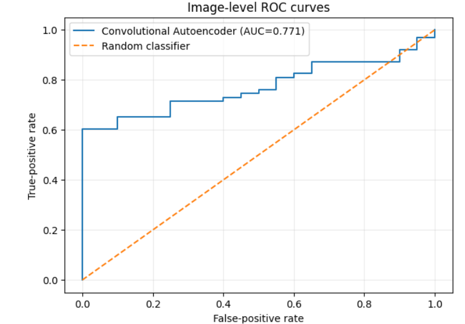
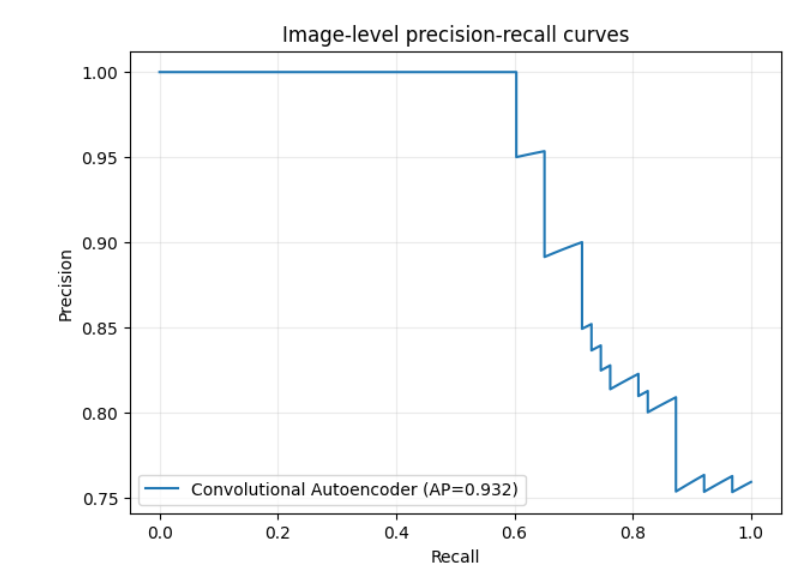
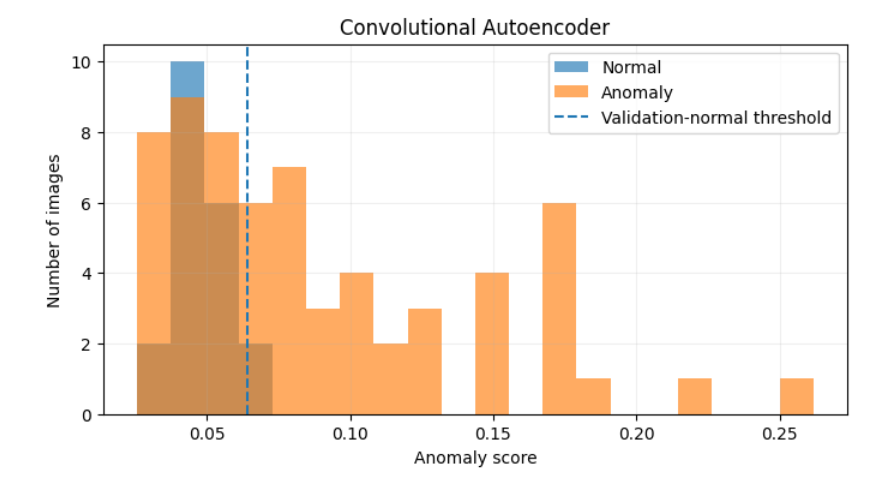
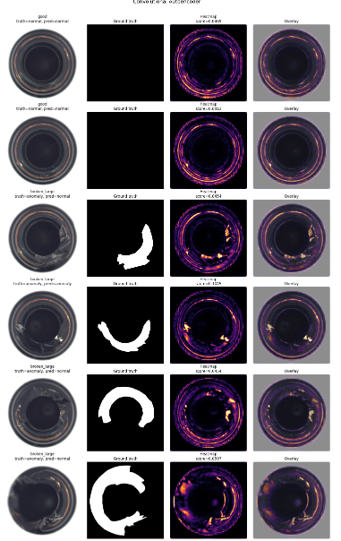

# Industrial Image Anomaly Detection Basics

A reproducible normal-only industrial image anomaly-detection project using
a convolutional autoencoder on the MVTec AD bottle category.

## Project Objective

The objective is to learn normal industrial appearance using defect-free
training images and identify anomalous test images using reconstruction error.

## Dataset

The project uses the MVTec AD bottle category.

- Training-normal images: 167
- Validation-normal images: 42
- Test images: 83
- Normal test images: 20
- Anomalous test images: 63
- Ground-truth anomaly masks: 63

The dataset itself is not included in this repository.

## Current Method

A convolutional autoencoder was trained using only normal images.

The anomaly map is calculated from channel-averaged squared reconstruction
error. The image anomaly score is obtained from the highest 1% of anomaly-map
pixels.

The decision threshold was selected from held-out normal validation images
using the 0.99 quantile. Test labels were not used for threshold selection.

## Current Results

| Metric | Result |
|---|---:|
| Accuracy | 0.6627 |
| Balanced accuracy | 0.7778 |
| Anomaly precision | 1.0000 |
| Anomaly recall | 0.5556 |
| Normal recall | 1.0000 |
| Anomaly F1 | 0.7143 |
| Macro-F1 | 0.6513 |
| Image ROC-AUC | 0.7714 |
| Average precision | 0.9322 |
| Pixel ROC-AUC | 0.7235 |
| Pixel average precision | 0.1582 |

## Confusion Matrix

The model correctly classified all 20 normal images but missed 28 of the
63 anomalous images.



## Defect-Specific Detection

| Defect type | Detection rate |
|---|---:|
| Broken small | 72.73% |
| Broken large | 65.00% |
| Contamination | 28.57% |
| Good-image false-positive rate | 0.00% |

## Visual Results

### Training Loss



### ROC Curve



### Precision-Recall Curve



### Score Distribution



### Anomaly Heatmaps


## Main Finding

The model is conservative. It produced no false alarms on the normal test
images, but anomaly recall was only 55.56%. Contamination was the most difficult
defect type.

## Why Accuracy Is Currently 66.27%

The model correctly classified all 20 normal test images but detected only
35 of 63 anomalous images. Therefore, 28 anomalous samples were classified
as normal.

The model is conservative because the anomaly threshold was selected using
the 0.99 quantile of normal validation scores. This produced zero false
positives but reduced anomaly recall to 55.56%.

Additional limitations include the small convolutional autoencoder,
128 × 128 input resolution, top-1% error aggregation, limited normal training
data, and the difficulty of reconstructing subtle contamination defects.

## Planned Improvements

- Compare threshold quantiles 0.95, 0.975, and 0.99.
- Increase input resolution to 224 and 256 pixels.
- Compare maximum, mean, top-1%, and top-5% anomaly scores.
- Evaluate L1, MSE, SSIM, and perceptual reconstruction losses.
- Run the pretrained ResNet-18 feature baseline.
- Add full PaDiM and PatchCore implementations.
- Repeat experiments using at least three random seeds.
- Evaluate additional MVTec AD categories.

## Future Research Directions

- Self-supervised Vision Transformer representations
- Multi-class defect recognition
- Improved anomaly localization
- Uncertainty-aware inspection with human review
- Cross-dataset evaluation
- Edge-device deployment
- Agentic AI for automated experiment planning and critique

## Repository Structure

```text
notebooks/   Executed Kaggle notebook
figures/     Training and evaluation plots
results/     Metrics, predictions, and experiment configuration
